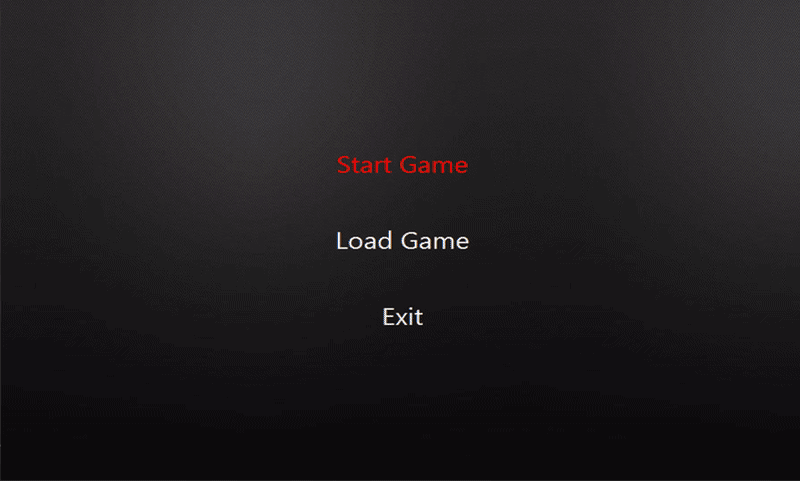

# Maze Runner
This is a 2D top-down shooter game made with Java and JavaFX, you simply try to escape the maze by shooting walls and picking ammo and avoiding bombs.

## Preview

## Guide
- The main objective is to reach the golden gate in the bottom right in one piece
- The white bar in the bottom indicates your health/ammo/score
- The bomb will damage you by 20 health points
- The shield will protect you from the damage of one bomb
- the yellow wall is breakable by shooting at it
- The gift can give you 5 bullets or refill your health
- The green flag will mark its spot as a checkpoint so you can return to it when you die

    ### Controls
    - arrow keys for movement
    - space to shoot